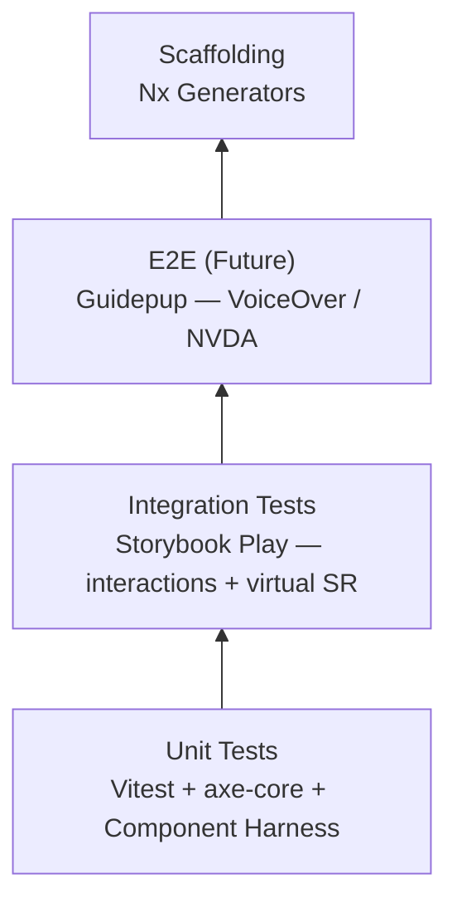

# Angular Comic Store

> A living demo and homework repository for the conference talk:
> **"Accessibility Testing Pyramid in Angular with Nx"**

## About

This repository accompanies a conference session on building accessible Angular applications with a clear, layered testing strategy inside an Nx monorepo.

It serves two purposes:

1. **Live demo** -- each feature illustrates a specific layer of the accessibility testing pyramid.
2. **Homework assignments** -- numbered tasks that let attendees practice each concept hands-on.

## Accessibility Testing Pyramid

The talk introduces a four-layer pyramid that moves from fast, automated checks at the base to high-fidelity, real-user validation at the top.



| Layer | Tool | What it covers |
|-------|------|----------------|
| **Unit** | Vitest, axe-core, Angular Component Harness | WCAG violations (contrast, ARIA, roles, labels), focus management, keyboard navigation, dynamic aria updates, interactive states |
| **Integration** | Storybook Play | Content verification, interactions, virtual screen reader spoken output |
| **E2E (Future)** | Guidepup + Playwright | Real VoiceOver/NVDA — when implemented |
| **Scaffolding** | Nx Generators | Auto-generate accessible components, harnesses, stories, and tests so a11y is built-in from the start |

## Tech Stack

| Category | Technology |
|----------|------------|
| Framework | Angular 21 |
| Monorepo | Nx 22.5 |
| UI Components | Angular Material |
| State Management | NgRx (SignalStore) |
| Unit Testing | Vitest, axe-core, Angular Component Harness |
| E2E Testing | Playwright |
| Screen Reader Testing | Guidepup |
| Component Workshop | Storybook |
| Linting | ESLint, Prettier |
| Styles | SCSS |

## Monorepo Structure

```
angular-comic-store/
├── apps/
│   ├── angular-comic-store/    # Main application
│   └── angular-comic-store-e2e/ # Playwright e2e tests
├── libs/                        # Shared libraries (feature, UI, data-access, util)
├── tools/                       # Nx generators and workspace scripts
├── TASKS.md                     # Numbered task index
├── CONTRIBUTING.md              # Contributor guidelines
└── nx.json                      # Nx workspace configuration
```

Libraries will follow Nx library-type conventions:

| Type | Purpose | Example |
|------|---------|---------|
| `feature` | Smart components, pages, routing | `libs/comics/feature-browse` |
| `ui` | Presentational (dumb) components | `libs/shared/ui-card` |
| `data-access` | State management, API services | `libs/comics/data-access` |
| `util` | Pure functions, helpers, pipes | `libs/shared/util-a11y` |

## Getting Started

### Prerequisites

- Node.js >= 20
- npm >= 10

### Install

```bash
git clone https://github.com/<your-username>/angular-comic-store.git
cd angular-comic-store
npm install
```

### Develop

```bash
npx nx serve angular-comic-store
```

### Test

```bash
# Unit tests
npx nx test angular-comic-store

# Lint
npx nx lint angular-comic-store

# E2E
npx nx e2e angular-comic-store-e2e
```

### Visualize the project graph

```bash
npx nx graph
```

## Task Index

All tasks are tracked in [`TASKS.md`](./TASKS.md). Each task has a sequential number that never changes once assigned. See that file for the full list with statuses and branch references.

## Resources

- [WCAG 2.2 Quick Reference](https://www.w3.org/WAI/WCAG22/quickref/)
- [axe-core](https://github.com/dequelabs/axe-core)
- [Angular CDK Accessibility](https://material.angular.io/cdk/a11y/overview)
- [Angular Component Harness](https://material.angular.io/cdk/test-harnesses/overview)
- [Guidepup](https://www.guidepup.dev/)
- [Storybook Accessibility Addon](https://storybook.js.org/addons/@storybook/addon-a11y)
- [Nx Documentation](https://nx.dev)

## License

MIT
